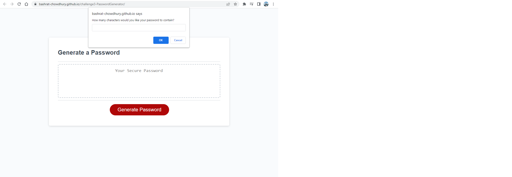
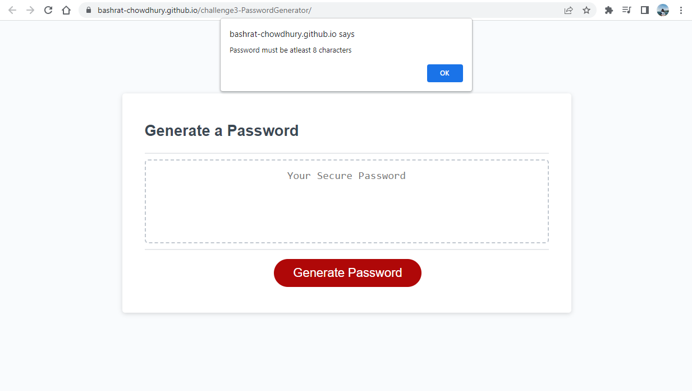
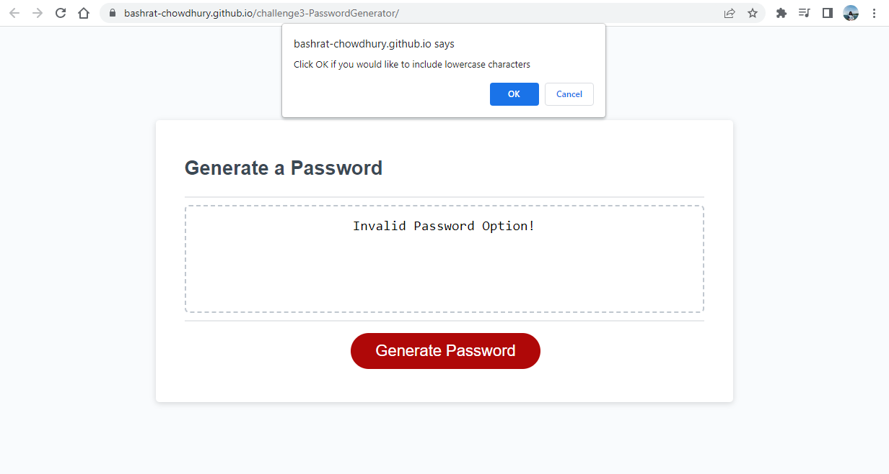
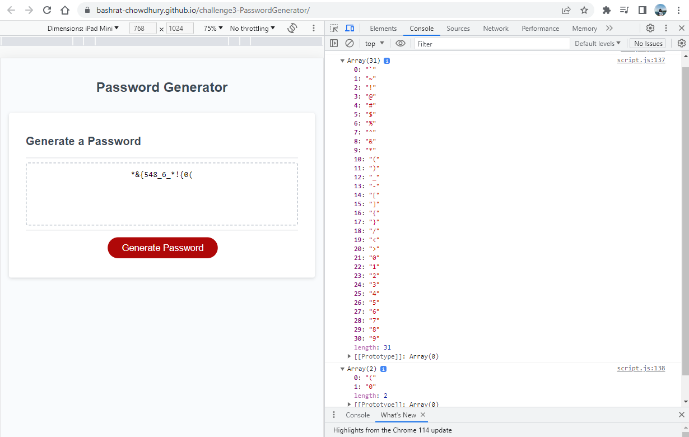

# <Password Generator>

## Description

This project was to modify a started code to create an application that will allow the user to geerate a secure, random password based on certain criterion. The user is able to select the criteria that they want to be satisfied for their password. This includes selecting the length of the password and the type of characters they want in their password : special characters, numeric characters, lowercased characters or uppercased characters.

A strong and unpredictable password is crucial for many purposes. It is one of the crucial parameters to keep many types of confidential data secure. It can be used to keep personal data as well as employer data protected.

Several javascript functionalities were utilized to create this project. Random generators were used in functions to randomize the selection and order of the password, prompt functionalities like "alert" and "confirm"  were used to display prompt messaging based on conditional statements and to take user selection into account when creating the password. Furthermore, arrays and "concat" functionality was used to create the appropriate arrays to select the password characters from.

## Installation

N/A

## Usage

The application will first prompt the user to input the length of the desired password once they click on the "Generate Password" CTA. 

This initial input must be a numeric character between 8 and 128, or else the approprite error message will display on the prompt. 

Following the inital input of a satisfactory password length, the prompt will display 4 more consecutive prompt messaging to ask the user if they want to include the following types of chatracters: special characters, numeric characters, lowercase characters and uppercase characters. 

The console will display 2 arrays of all the available characters to construct the password with. Using a random sector, a password will be generated using the characters from these arrays in a randomized order, making sure atleast one of the selected character types are included in the password.

Link to the deployed app: https://bashrat-chowdhury.github.io/challenge3-PasswordGenerator/ 

## Credits

N/A

## License

N/A

---